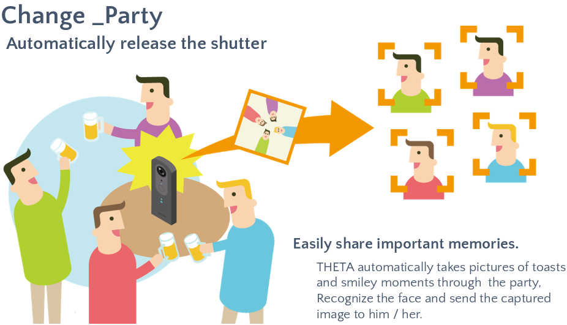
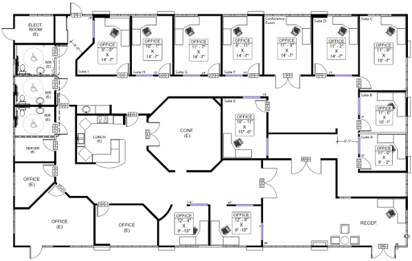
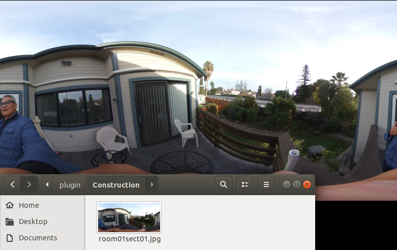

# Plugin Ideas

These are ideas for plugins to help with brainstorm discussions. 
They have not been implemented.

## Example Construction Concept

I created a new plugin called *ConstructionPlugin* to
reduce the time taken to take hundreds of images at construction sites.

The idea is to use a separate application to create a route of rooms.
The plugin then saves unique files names for each room.

As a first step, the plugin saves the construction images
with a file name prefaced by *construction*.

I then created a directory called `Construction` to store
all my construction pictures for business 
separately from the normal camera pictures stored in `100RICOH`.
I am using a more scalable naming convention of the form
 `room01sect01.jpg`.

In `MainFragment.java`, I changed the file save location.

    private Camera.PictureCallback mJpegPictureCallback = new Camera.PictureCallback() {
        @Override
        public void onPictureTaken(byte[] data, Camera camera) {
            mParameters.set("RIC_PROC_STITCHING", "RicStaticStitching");
            mCamera.setParameters(mParameters);
            mCamera.stopPreview();

            String fileUrl = "/storage/emulated/0/DCIM/Construction/room01sect01.jpg";
            try (FileOutputStream fileOutputStream = new FileOutputStream(fileUrl)) {
                fileOutputStream.write(data);
            } catch (IOException e) {
                e.printStackTrace();
            }

            mCamera.startPreview();
        }
    };

Using `adb shell`, I can log into the camera and make sure that it's saving the file in the correct filename format and directory. On the camera, you can access it in `/mnt/sdcard/DCIM/Construction/`

Back on my workstation, I can copy all the construction images from the camera to my workstation with:

    $ adb pull /sdcard/DCIM/Construction/

In this test, transferring 13 images took 1.9 seconds using a USB cable. 
The files total 42 MB. Each image has a resolution of 5376x2896.  
Once I have the image on my workstation, I can then open the image up in a file browser to
see it in equirectangular format.

My code snippet now looks like this:

    if (roomNumber > 9)
    {
        roomNumberStr = Integer.toString(roomNumber);
    } else {
        roomNumberStr = "0" + Integer.toString(roomNumber);

    }

    String fileUrl = "/storage/emulated/0/DCIM/Construction/room" + roomNumberStr + "sect01.jpg";
    try (FileOutputStream fileOutputStream = new FileOutputStream(fileUrl)) {
        fileOutputStream.write(data);
        roomNumber = roomNumber + 1;