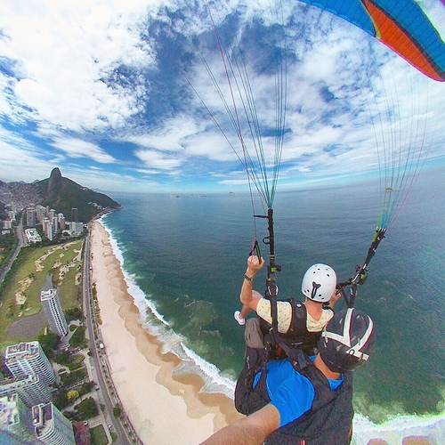
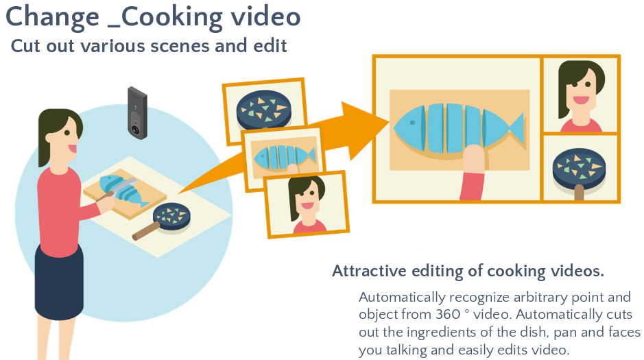

# Plugin Concepts from the Community

We are constantly working with community members to support "ideation," scoping out possible plug-ins and helping define concepts. Dealing with feature requests and turning those into workable code is a process. Brainstorming, coming up with concepts, sharing them, stress-testing them, and doing this within in the community can move a concept to real code and a finish, sellable product more quickly.

## Hands-Off Action Time-Lapse Concept

Thanks to [Daniel Towersey](https://community.theta360.guide/u/danieltowersey/summary) from the theta360.guide community for this concept for a "Hands-Off Action Time-Lapse" plug-in for the THETA V to be using in paragliding. 

### Description of Requirements from Daniel:

> > We use GoPro for standard photo and video included in our package, and sell 360º photos as an optional photo package.
I used an LG 360 cam with I st with the app for interval shooting with the app before take off, and then just needed to press the camera button in flight (on a monopod).
I changed my LG for the Theta V due to 4k video and much superior seaming of the images, but unfortunately found out that for interval shooting I need to press the button on the app, not the camera, with is a pain… other pilots use the wired ca-3 remote shutter with is also clumsy…
Can’t get my head around the fact that the Theta doesn’t have a wireless remote shutter, and the camera button will only take still images even though it is set for interval shooting through the control app…

And there are users waiting to get their hands on an app like this:

> > Here at our paragliding site alone there must be about 30 to 50 Theta users awaiting such an update, or even better, a wireless remote shutter to substitute the ca-3 cable remote…

### To build this plug-in, here's a possible Project Requirements

* Plug-in inside of camera handles timelapse
* Shutter button starts/stops timelapse
* White LED above shutter button indicates that it is in plug-in mode
* Magenta WiFi LED below shutter button flashing indicates that timelapse is activated
* Rate of flashing provides a clue as to current setting
* Button side button (mode) cycles through pre-set settings
* Companion mobile app is used to configure timelapse settings and store them into camera

Some more thoughts from Craig ([@codetricity](https://community.theta360.guide/u/codetricity/summary)) about 
possible alternatives to this project using hardware to trigger the timelapse with WiFi or Bluetooth are [here](https://community.theta360.guide/t/using-mesh-iot-button-with-ricoh-theta-to-create-remote-wireless-shutter/1641/15). 
Right now, it looks like the best way to approach the project with with software only and avoid the need to
manufacture or buy a wireless remote. Scroll up to get the full original discussion.

Think you could build this? :-)

# Plug-in Concepts from RICOH 

## Example Construction Concept

I created a new plugin called *ConstructionPlugin* to
reduce the time taken to take hundreds of images at construction sites.

The idea is to use a separate application to create a route of rooms.
The plugin then saves unique files names for each room.

As a first step, the plugin saves the construction images
with a file name prefaced by *construction*.

I then created a directory called `Construction` to store
all my construction pictures for business 
separately from the normal camera pictures stored in `100RICOH`.
I am using a more scalable naming convention of the form
 `room01sect01.jpg`.

In `MainFragment.java`, I changed the file save location.

    private Camera.PictureCallback mJpegPictureCallback = new Camera.PictureCallback() {
        @Override
        public void onPictureTaken(byte[] data, Camera camera) {
            mParameters.set("RIC_PROC_STITCHING", "RicStaticStitching");
            mCamera.setParameters(mParameters);
            mCamera.stopPreview();

            String fileUrl = "/storage/emulated/0/DCIM/Construction/room01sect01.jpg";
            try (FileOutputStream fileOutputStream = new FileOutputStream(fileUrl)) {
                fileOutputStream.write(data);
            } catch (IOException e) {
                e.printStackTrace();
            }

            mCamera.startPreview();
        }
    };

Using `adb shell`, I can log into the camera and make sure that it's saving the file in the correct filename format and directory. On the camera, you can access it in `/mnt/sdcard/DCIM/Construction/`

Back on my workstation, I can copy all the construction images from the camera to my workstation with:

    $ adb pull /sdcard/DCIM/Construction/

In this test, transferring 13 images took 1.9 seconds using a USB cable. 
The files total 42 MB. Each image has a resolution of 5376x2896.  
Once I have the image on my workstation, I can then open the image up in a file browser to
see it in equirectangular format.

My code snippet now looks like this:

    if (roomNumber > 9)
    {
        roomNumberStr = Integer.toString(roomNumber);
    } else {
        roomNumberStr = "0" + Integer.toString(roomNumber);

    }

    String fileUrl = "/storage/emulated/0/DCIM/Construction/room" + roomNumberStr + "sect01.jpg";
    try (FileOutputStream fileOutputStream = new FileOutputStream(fileUrl)) {
        fileOutputStream.write(data);
        roomNumber = roomNumber + 1;
