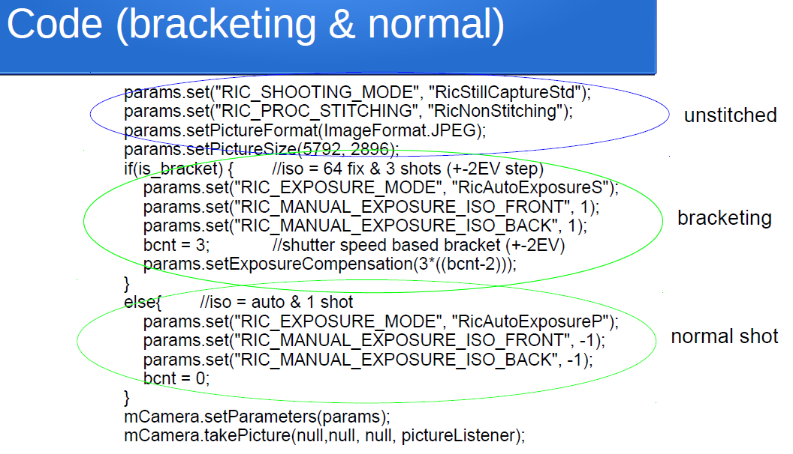
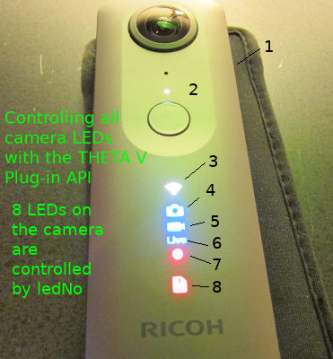
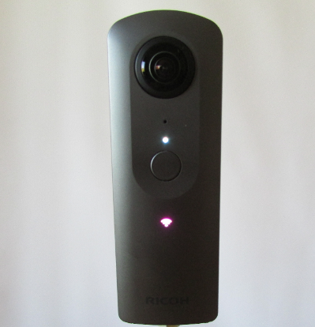

# Custom Development

## Overview

Your primary way to control the camera is with the Android Camera class. Although this API was
deprecated in level 21, it still works. Make sure you use the older Camera class and not
the newer camera2 API.

Use the offiical Android API documentation as your main reference.

[https://developer.android.com/reference/android/hardware/Camera.html](https://developer.android.com/reference/android/hardware/Camera.html)

There are a set of THETA features that are not covered by the Android 
[Camera](https://developer.android.com/reference/android/hardware/Camera.html)
API. These are covered by using 
[Camera.Parameters](https://developer.android.com/reference/android/hardware/Camera.Parameters.html)

Example:

    mParameters.set("RIC_PROC_STITCHING", "RicStaticStitching");
    mCamera.setParameters(mParameters);

Here's example of setting multiple parameters and then taking a picture.

        public void takePicture() {
            mParameters.setPictureSize(5376, 2688);
            mParameters.set("RIC_SHOOTING_MODE", "RicStillCaptureStd");
            mParameters.set("RIC_EXPOSURE_MODE", "RicAutoExposureP");
            mParameters.set("recording-hint", "false");
            mParameters.setJpegThumbnailSize(320, 160);
            mCamera.setParameters(mParameters);
            mCamera.takePicture(null, null, mJpegPictureCallback);
        }

There is extensive documentation on the 
[RICOH Developer Connection THETA Plug-in portal](https://api.ricoh/docs/theta-plugin/sdk/)

The plug-in SDK is a great place to get started. The SDK can be downloaded from [GitHub](https://github.com/ricohapi/theta-plugin-sdk). If
you have any problems 
please send an email to jcasman@oppkey.com for
 friendly (I hope) help.  :-)

## Camera Hardware

- APQ8053 ([Snapdragon 625](https://www.qualcomm.com/products/snapdragon/processors/625))
    - CPU: Cortex A-53 x8
    - GPU: Qualcomm AdrenoTM 506
- 3GB LPDDR3 SDRAM, 32GB eMMC
- WLAN/BT (2 models)
    - 2.4GHz (1-11ch) only
    - 2.4GHz(1-11ch) + 5GHz(W52)
- 12MP CMOS x2, 4ch MEMS microphones, 1ch speaker

## Using the WiFi Web API 

In addition to the Android Camera class, your plug-in can also use the 
[RICOH THETA API v2.1](https://developers.theta360.com/en/docs/v2.1/api_reference/) web API. Send POST commands 
to the camera's Web API at (http://localhost:8080/). When using the Web API from the plug-in, digest authentication is not required regardless of the wireless LAN mode. For detailed specifications of the Web API, please refer to [API Reference - v2.1 - API & SDK \| RICOH THETA Developers](https://developers.theta360.com/en/docs/v2.1/api_reference/)

The Web API can not be used when the plug-in controls the camera device using the Camera API.

## Configuration of Plug-in With Web Server

If you want to configure your plug-in with an external mobile app, one strategy is to embed an HTTP server into
your plug-in. A simple mobile app can then talk to the plug-in through the embedded HTTP server.
With this configuration strategy, the plug-in can launch a web server on port 8888 that provides a WebUI or its own API. 

You must use port 8888 on the plug-in web server, as the other ports are blocked. You can then
build a basic app on a smartphone to access the 
plug-in web server on the THETA V.

Developers have reported success using NanoHttpd, which is available from GitHub at 
[https://github.com/NanoHttpd/nanohttpd](https://github.com/NanoHttpd/nanohttpd).

Another way to access the plug-in configuration page you create is to use the OpenPluginPage API from the Ricoh v2.1 WiFi API on port 80. It will redirect to port 8888.

Information on the OpenPluginPage API is available here:

[https://developers.theta360.com/en/docs/v2.1/api_reference/protocols/open_plugin_page.html](https://developers.theta360.com/en/docs/v2.1/api_reference/protocols/open_plugin_page.html)

Your app can look for the presence or absence of the web server by using the Web API's [camera._listPlugins](https://developers.theta360.com/en/docs/v2.1/api_reference/commands/camera._list_plugins.html). The information from camera._listPlugins consists of information described in the configuration file (\assets\settings.json) of each plug-in. If the setting file does not exist or the setting value is incorrect, the default value is written in the camera._listPlugins information. 

Sample configuration file:

~~~
{
 "webServer": true
}
~~~

From talking with the community, we think the process is shown below.

## Internal Storage 
The THETA V has a maximum storage size of 32GB. Developers can use 19GB  for storage of their plug-in applications and approximately 1.5GB for the plug-in itself. The partition for data is `/data`.

The sample code stores data to `DCIM`.

This is an example of saving all your images to a sub-directory `Construction` and then
adding a number to the file name. There's a separate bit of code to iterate the roomNumber.

    String fileUrl = "/storage/emulated/0/DCIM/Construction/room" + roomNumberStr + "sect01.jpg";

## Finishing a Plug-in

Push and hold the Mode Button for 2 seconds to finish. When the plug-in detects that the Mode Button has been pressed for 2 seconds, it must quit. When the plug-in finishes, a [notification of termination for the plug-in](/docs/theta-plugin-ref/broadcast-intent/#notifying-completion-of-plug-in) must be made.

## Dual-Fish Still Image

If you want to save still images as dual-fisheye, use this parameter:

    mParameters.set("RIC_PROC_STITCHING_TYPE", "RicNonStitching");

The size of the dual-fish image is 5792x2896. Use the command below:

    mParameters.setPictureSize(5792, 2896);

[This article](https://community.theta360.guide/t/dual-fisheye-images-with-theta-v-plug-in/2692/8?u=codetricity) 
provides more information on a plug-in built by community
developer Ichi Hirota.

The picture below is from Ichi Hirota.

Here's example code from Ichi Hirota for bracketing.

## Camera LEDs

### LED Colors

In `pluginlibrary`, the LED colors are defined in `LedColor`.

    RED("red", 0b001),
    GREEN("green", 0b010),
    BLUE("blue", 0b100),
    CYAN("cyan", 0b110),
    MAGENTA("magenta", 0b101),
    YELLOW("yellow", 0b011),
    WHITE("white", 0b111),;

### Camera LED Identification 

### LED Usage Example

In `MainActivity`, there is an example for the LED.

    public void onKeyUp(int keyCode, KeyEvent event) {
        /**
            * You can control the LED of the camera.
            * It is possible to change the way of lighting, the cycle of blinking, the color of light emission.
            * Light emitting color can be changed only LED3.
            */
        notificationLedBlink(LedTarget.LED3, LedColor.BLUE, 1000);

#### Changing LED Color and Blink Rate

The example below will use flash LED3, the WiFi LED, faster and display
a magenta color.

        notificationLedBlink(LedTarget.LED3, LedColor.MAGENTA, 300);

#### Changing LED Target

The example below shows how to blink LEDs 4, 5, 6, 7, and 8. Note that the
color is ignored.

    notificationLedBlink(LedTarget.LED4, LedColor.BLUE, 300);
    notificationLedBlink(LedTarget.LED5, LedColor.BLUE, 300);

    notificationLedBlink(LedTarget.LED6, LedColor.BLUE, 300);
    notificationLedBlink(LedTarget.LED7, LedColor.RED, 300);
    notificationLedBlink(LedTarget.LED8, LedColor.RED, 300);

## Camera Buttons

There are three buttons you can map:

| Button Common Name | Name in Library | Code | Location |
| ------------------ | ------------------- |:----:| -------- |
| WiFi               | KEYCODE_WLAN_ON_OFF | 284  | side middle |
| Mode               | KEYCODE_MEDIA_RECORD | 130  | side bottom |
| Shutter            | KEYCODE_CAMERA | 27   | front       |

In the pluginlibrary for the SDK, the `KeyReceiver` file has these values:

    public class KeyReceiver extends BroadcastReceiver {
        public static final int KEYCODE_CAMERA = 27;
        public static final int KEYCODE_MEDIA_RECORD = 130;
        public static final int KEYCODE_WLAN_ON_OFF = 284;

        public static final String ACTION_KEY_DOWN = "com.theta360.plugin.ACTION_KEY_DOWN";
        public static final String ACTION_KEY_UP = "com.theta360.plugin.ACTION_KEY_UP";
        private static final String KEY_CODE = "keyCode";
        private static final String KEY_EVENT = "KeyEvent";

In `MainActivity.java`, there is an example of using the `keyCode`.

    protected void onCreate(Bundle savedInstanceState) {
        super.onCreate(savedInstanceState);
        setContentView(R.layout.activity_main);

        // Set a callback when a button operation event is acquired.
        setKeyCallback(new KeyCallback() {
            @Override
            public void onKeyDown(int keyCode, KeyEvent event) {
                if (keyCode == KeyReceiver.KEYCODE_CAMERA) {
                    /*
                     * To take a static picture, use the takePicture method.
                     * You can receive a fileUrl of the static picture in the callback.
                     */
                    new TakePictureTask(mTakePictureTaskCallback).execute();
                }
            }

## Text to Speech
As of May 8, 2018, `android.speech.tts` does not work. This may
start working in a future update. For now, you can try other Text-Speech engines
for Android. A list of untested engines is [here](http://hyperionics.com/TtsSetup/eng/TtsInfo.html). Another untested possibility
could be the [Flite TTS Engine for Android](https://github.com/happyalu/Flite-TTS-Engine-for-Android).

Currently, human speech can be played directly from the internal speaker of 
the THETA V. However, the volume is low. We are trying to figure out how
to increase the volume.

Here's a [test of the THETA V playing "I Have a Dream"](https://youtu.be/AeebH7ONTkg) by Dr. Martin Luther King Jr.

## Storage in eMMC

`/sdcard/DCIM/` can be used.

## XMP Data
[UPDATED May 1, 2018] Images produced by the Plugin Application have XMP data in them. These screenshots are just looking at image properties using the GNOME Image Viewer app on an Ubuntu laptop. 

Here is an image taken with the Plugin Application, showing ProjectionType and more:

In comparison, here is an normal image taken at my desk, using the RICOH THETA V as a camera, not in Plug-in Mode. 

However, I have access to an example of a dual fish-eye image taken with a plug-in built by a developer that does not include XMP data. This may indicate that as you develop your plug-in, you may need to inject XMP data. There's an uncomfirmed rumor that Ricoh is working
on a library to help with this.

Here's the example:

