# Ricoh THETA V Plugin Application Development - Community Guide

<!--  -->

# [Register Now!](https://register.gotowebinar.com/register/2633164712729319681)

*By [Craig Oda and Jesse Casman](/about/) of [Oppkey](http://oppkey.com/)*

This is a compilation of community experiences and tests from members of [theta360.guide](http://theta360.guide), an
independent developer community for RICOH THETA cameras. This is not an
official Ricoh group. The *community-created* document you are reading may contain factual errors. 

## Official Ricoh Documentation

- [Plug-in SDK](https://github.com/ricohapi/theta-plugin-sdk)
- [Plug-in API](https://api.ricoh/docs/theta-plugin/api/?utm_source=theta360guide)

## THETA V Plugin Application Development Overview

The THETA V uses Android as the operating system. Because of this, the THETA V application development process is the same as the development process for an Android phone. Connect the THETA V to a development workstation, either Mac, Windows, or Linux with a micro USB cable and connect to the camera with adb. You will need a THETA V 
that is in developer mode. To put your THETA V into developer mode during the closed-beta period, 
please contact jcasman@oppkey.com. He will need
to get physical access to your camera. More
information on a process to put the THETA V into developer mode remotely should be available when the 
THETA V partner program is launched in 2018 (specific date of launch has not been announced). 

This document describes the following development process:

- Android SDK Installation
- Import Ricoh sample Plugin and Update Android Build System
- Getting a THETA V Plugin Development Camera
- USB cable connection between THETA V and development workstation
- Using adb to connect to the camera
- Use adb to install plugin into camera
- Use Vysor to help with testing

## Required Hardware and Software for Development

  * The SDK was tested with a RICOH THETA V under the following conditions.
  * Camera
    * Hardware
      - RICOH THETA V
    * Firmware
      - ver.2.20.1 and above
        - Information on checking and updating the firmware is [here](https://theta360.com/en/support/manual/s/content/pc/pc_09.html).
  * Development Environment
      * Windows 10 Version 1709
        - In Windows 7, adb connection does not work with USB
      * macOS High Sierra ver.10.13
    * Development ・ Build environment
      * Android Studio 3.0+
      * gradle 3.0.1
      * Android SDK (API Level 25)
      * compileSdkVersion 26
      * buildToolsVersion "26.0.3"
      * minSdkVersion 25
      * targetSdkVersion 25

------------------------------------------

## Android SDK Installation

This community guide has been tested with the Android SDK 3.0.1 and 3.1.1 on Windows 10 (1709) 64bit and Ubuntu 17.10. The process should be similar on Mac OS X.

### Download Android Studio

Download Android Studio from the site below.

https://developer.android.com/studio/index.html

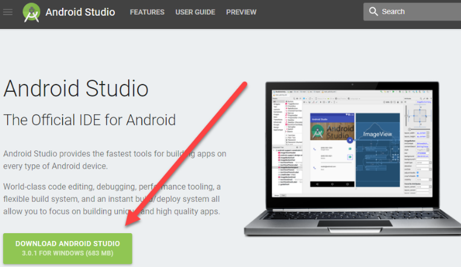
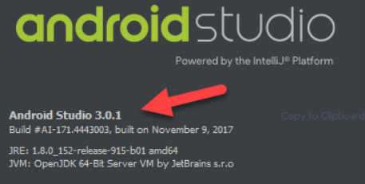

## Import Ricoh Plugin SDK and Update Android Build System

Install Ricoh Plugin SDK and Update Android Build System.

    $ l
    app/          gradle/            gradlew      LICENSE.txt     README.md
    build.gradle  gradle.properties  gradlew.bat  pluginlibrary/  settings.gradle
    
If you've just installed Android Studio, you may choose Import project from the Welcome to Android Studio start up screen:

Otherwise, use the menus. Import Project from File -> New -> Import Project.

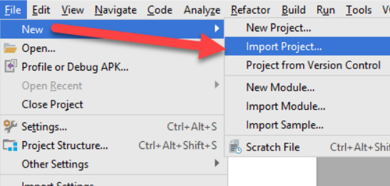

You will see the following status bar for a few minutes.

After the process completes, you will see a Windows Security Alert.

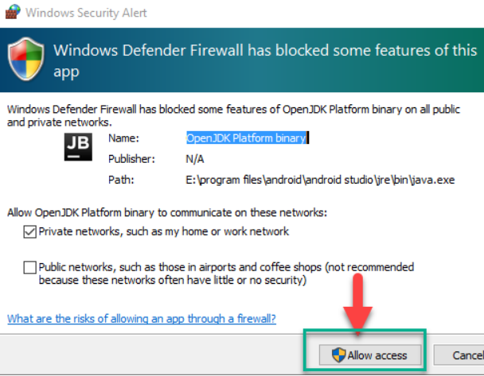

Allow access to the OpenJDK Platform.

You may need to update your Build Tools or Install missing platforms and sync project. 

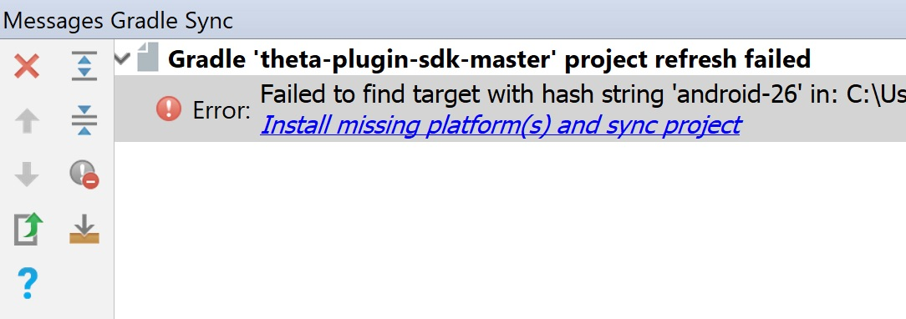

Accept the license terms for 26.0.3 and press Next.

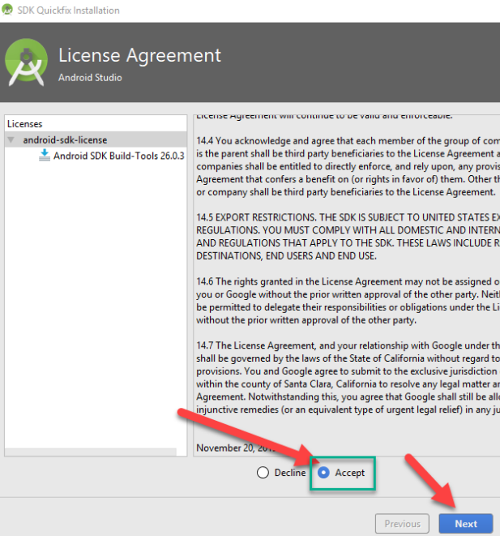

The components will be installed for you.

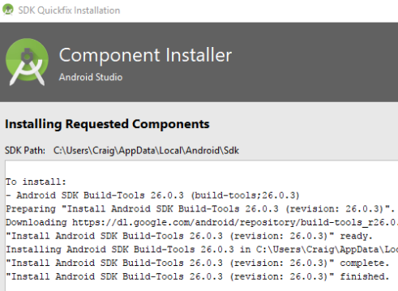

Allow Gradle enough time to resync your project.

Although not necessary, I decided to update Gradle.

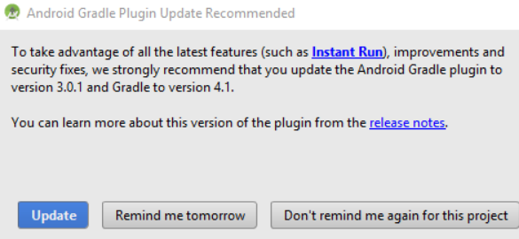

You can now inspect your Project in the navigation area.

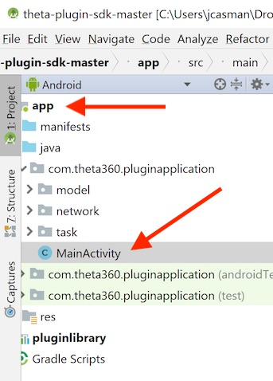

Build the APK

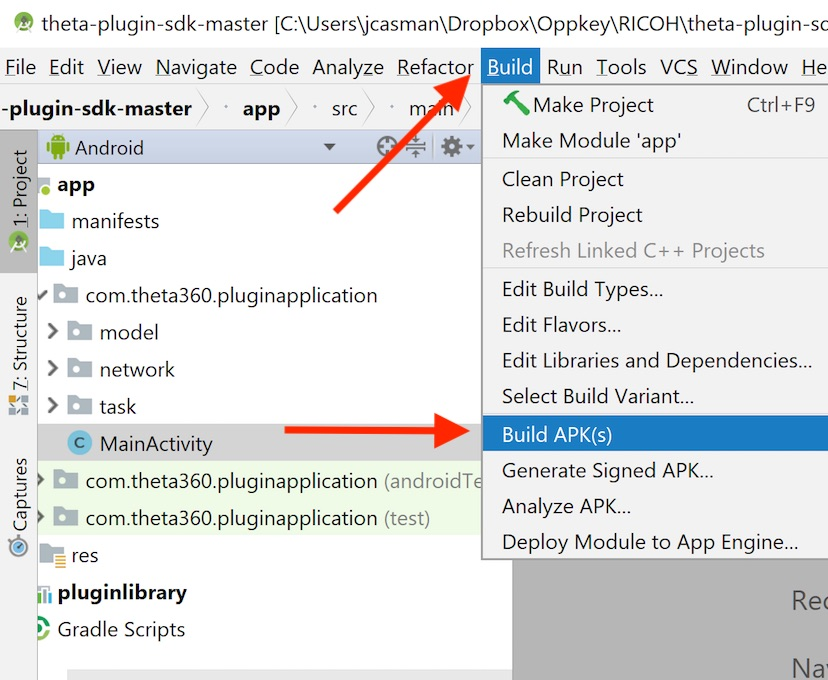

At the bottom of the Android Studio window, you will see the status of the build.

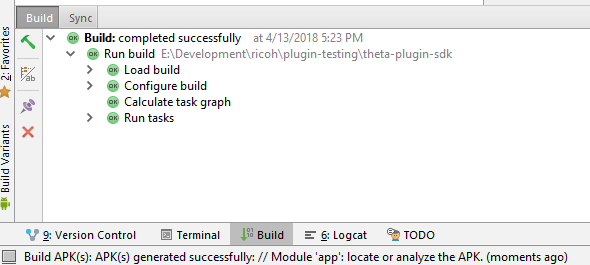

Click on the status bar to show your Event Log and locate the APK.

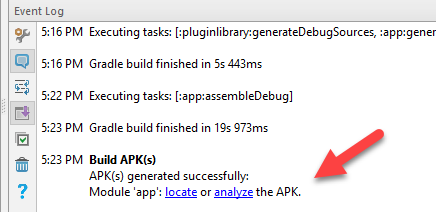

Locate the file `plugin-debug.apk` and install it onto the THETA V

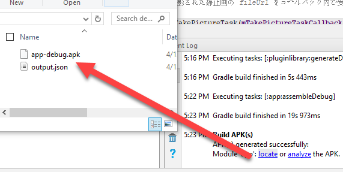

## Putting Your THETA V into “Developer Mode”

Normal THETA V cameras are not enabled for the development of plugins.
As of April 30, 2018, the THETA V plugin development process is in closed beta. 
To discuss your plugin project, you can contact Ricoh directly
or you can also contact the independent developer community at [http://theta360.guide](http://theta360.guide) and they can forward your request to the appropriate people at Ricoh. 
Alternately, you can send an email to Jesse Casman at jcasman@oppkey.com for more information.
Please understand that only a small number of requests can be fulfilled.

## USB cable connection between THETA V and development workstation

With the THETA off, connect it to your developer workstation with a USB cable.

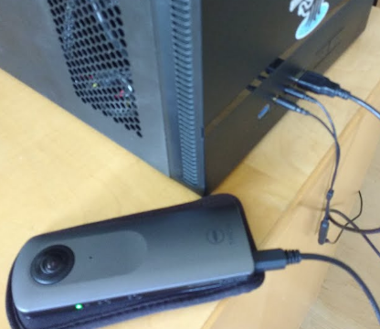

Using adb to connect to the camera

On Windows, adb is installed into 

    C:\Users\[user]\AppData\Local\Android\sdk\platform-tools

You should add this into your PATH.  On Windows, you can edit the PATH with *Control Panel -> System and Security -> System -> Advanced system settings -> Environment Variables -> Path*

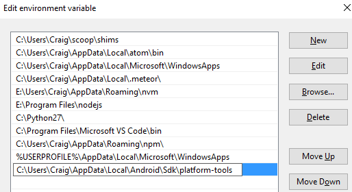

After putting adb into your `PATH`, start a new cmd shell and run 

    adb devices -l

If you don't use `-l`, you can still identify the device by the serial number
of your THETA V. In the example below, my THETA V has a serial number of 00101082.

    $ adb devices
    List of devices attached
    * daemon not running. starting it now at tcp:5037 *
    * daemon started successfully *
    00101082	device

You can log into the camera, and do an `ls` to list all files, just like in any Android system

    $ adb shell
    msm8953_64:/ $ ls -l                                                                                                                                                 
    total 4240
    drwxrwxr-x   5 media_rw media_rw    4096 2017-01-01 00:00 DCIM
    dr-xr-xr-x  17 root     root           0 1970-04-02 10:08 acct
    drwxr-xr-x   2 root     root          40 1970-01-01 00:00 bt_firmware                             
    lrwxrwxrwx   1 root     root          50 1970-01-01 00:00 bugreports -> /data/user_de/0/com.android.shell/files/bugreports
    drwxrwx---   6 system   cache       4096 2017-11-14 15:55 cache
    lrwxrwxrwx   1 root     root          13 1970-01-01 00:00 charger -> /sbin/healthd
    drwxr-xr-x   2 root     root           0 1970-04-02 10:08 config
    lrwxrwxrwx   1 root     root          17 1970-01-01 00:00 d -> /sys/kernel/debug
    drwxrwx--x  43 system   system      4096 2017-09-21 14:00 data
    -rw-r--r--   1 root     root         966 1970-01-01 00:00 default.prop
    drwxr-xr-x  15 root     root        3180 2017-11-27 12:50 dev
    drwxr-xr-x   3 root     root        4096 1970-01-01 00:00 dsp

Change directory into DCIM. The RICOH THETA Plug-in SDK uses the
[android.hardware.Camera](https://developer.android.com/reference/android/hardware/Camera.html) class. It saves images into the normal location you would expect from an Android device. You can also use the [RICOH THETA API v2.1](https://developers.theta360.com/en/docs/v2.1/api_reference/), which is is a WebAPI based on OSC to take pictures from your plug-in by sending a POST command to the internal camera web server.

    127|msm8953_64:/DCIM/0 $ ls -l
    total 128
    drwxrwxr-x 2 media_rw media_rw  4096 2017-01-01 00:00 Alarms
    drwxrwxr-x 2 media_rw media_rw  4096 2017-09-22 22:31 Converted
    drwxrwxr-x 3 media_rw media_rw  4096 2017-09-19 18:15 DCIM
    drwxrwxr-x 2 media_rw media_rw  4096 2017-01-01 00:00 Download
    drwxrwxr-x 2 media_rw media_rw  4096 2017-01-01 00:00 Movies
    drwxrwxr-x 2 media_rw media_rw  4096 2017-10-02 15:31 MtpOperation
    drwxrwxr-x 2 media_rw media_rw  4096 2017-01-01 00:00 Music
    drwxrwxr-x 2 media_rw media_rw  4096 2017-01-01 00:00 Notifications
    drwxrwxr-x 2 media_rw media_rw  4096 2017-01-01 00:00 Pictures
    drwxrwxr-x 2 media_rw media_rw  4096 2017-01-01 00:00 Podcasts
    drwxrwxr-x 2 media_rw media_rw  4096 2017-01-01 00:00 Ringtones
    -rw-rw-r-- 1 media_rw media_rw 15972 2017-09-25 23:35 btsnoop_hci.log
    drwxrwxr-x 2 media_rw media_rw  4096 2017-09-21 14:26 ptp

Locate pictures and movies.

    msm8953_64:/DCIM/0/DCIM/100RICOH $

    msm8953_64:/DCIM/0/DCIM/100RICOH $ ls -l                                                                                                             
    total 554752
    -rw-rw-r-- 1 media_rw media_rw   1970120 2017-09-28 12:58 R0010025.JPG
    -rw-rw-r-- 1 media_rw media_rw   2402374 2017-09-28 12:58 R0010026.JPG
    -rw-rw-r-- 1 media_rw media_rw   2136165 2017-09-28 12:58 R0010027.JPG
    -rw-rw-r-- 1 media_rw media_rw   2810985 2017-09-28 12:59 R0010028.JPG
    -rw-rw-r-- 1 media_rw media_rw   1834346 2017-10-18 18:34 R0010035.JPG
    -rw-rw-r-- 1 media_rw media_rw    679681 2017-10-21 12:13 R0010036.JPG
    -rw-rw-r-- 1 media_rw media_rw   2103925 2017-10-21 14:16 R0010037.JPG
    -rw-rw-r-- 1 media_rw media_rw  52108839 2017-10-21 14:19 R0010038.MP4
    -rw-rw-r-- 1 media_rw media_rw 108450224 2017-10-21 14:20 R0010039.MP4

## Install Your Plugin into Camera

Use Android Studio
or

call `adb install -r ./plugin/build/outputs/apk/debug/plugin-debug.apk`

    $ adb install -r ./plugin/build/outputs/apk/debug/plugin-debug.apk 
    * daemon not running. starting it now at tcp:5037 *
    * daemon started successfully *
    Success

## Use Vysor to help with testing

Go to  [https://www.vysor.io/](https://www.vysor.io/) 
and install Vysor.

On Linux, you can Vysor with the information [here](https://github.com/koush/electron-chrome).

The basic process is shown below.

    git clone https://github.com/koush/electron-chrome.git
    cd electron-chrome
    npm install

Using the Chrome Store app id for Vysor:

    electron --enable-logging . --app-id=gidgenkbbabolejbgbpnhbimgjbffefm

After starting Vysor, you will be able to choose your device, *RICOH THETA_V*.  Press *View*.

Vysor will start up.

Click on the home button.

Any launcher will work. I'm using the Snapdragon Launcher.

You will see all the apps.

Go to App Settings

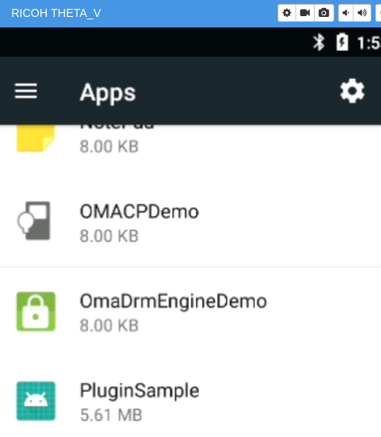

Set Permissions for *Storage* and *Camera*.

Launch App

The Vysor screen will be black.
