# Using Vysor to Help With Testing

Go to  [https://www.vysor.io/](https://www.vysor.io/) 
and install Vysor.

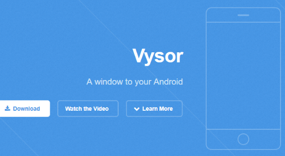

After starting Vysor, you will be able to choose your device, *RICOH THETA_V*.  Press *View*.

Vysor will start up.

Click on the home button.

Any launcher will work. I'm using the Snapdragon Launcher.

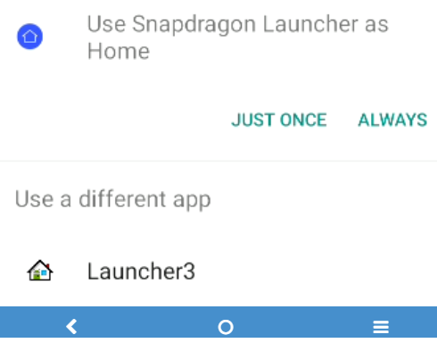

You will see all the apps.

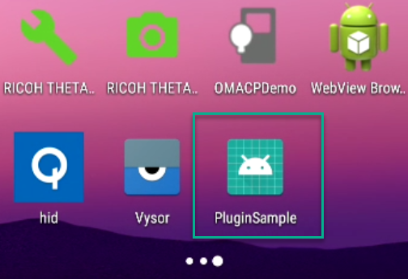

Go to App Settings

Set Permissions for *Storage* and *Camera*.

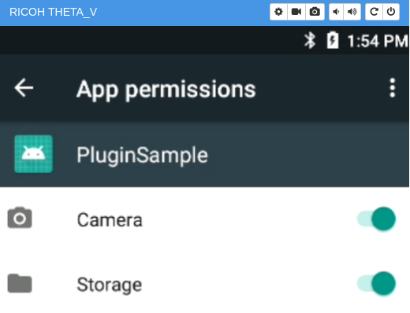

Launch App

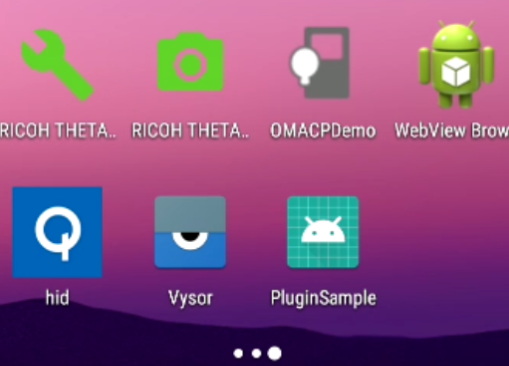

In the future, your plugin can be distributed through the THETA Store, downloaded, and used by all THETA V camera end-users. They will
be able to install the plugin with a computer application that Ricoh will provide.

End-users can choose your plugin with the official RICOH THETA mobile app or a custom application that you provide. For development, you can also select the active plug-in with the WiFi API. 

## Use Vysor to Verify Plugin Installation

You can install multiple plugins into the THETA V. In the example below,
I'm using Vysor to verify that I installed my new plugin 
*ConstructionPlugin* in addition to the *PluginSample* I installed
earlier.

Prior to selecting with my new *ConstructionPlugin* with the API, I set
the permissions with Vysor. Settings -> Apps -> YourAppName

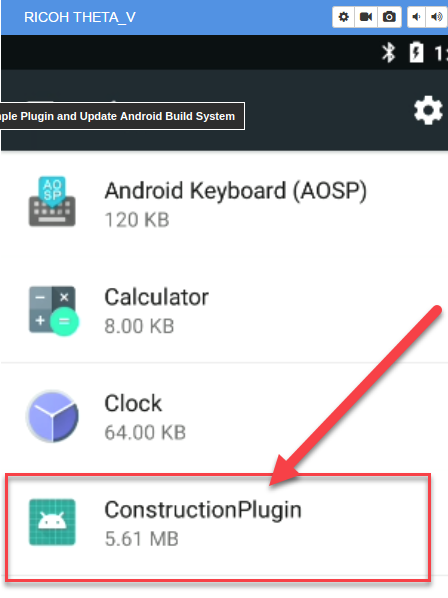

## Verify Image File Names with Vysor

In order to download the picture with adb, you first need to find out the exact filename. You can use Vysor to find the filename.

Go into File Manager

Down into DCIM

Down into 100RICOH

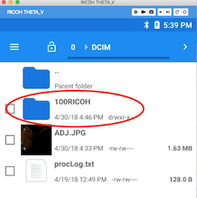

If you have a lot of images on the camera, you may need to scroll down to the bottom of the list.

There's your filename, the newest image. In this case, it's R0010047.JPG
   
Then use adb pull to download the picture to your local machine   
   
    $ adb pull /sdcard/DCIM/100RICOH/R0010047.JPG
    /sdcard/DCIM/100RICOH/R0010047.JPG: 1 file pulled. 21.2 MB/s (2790527 bytes in 0.126s)

## Using the Keyboard and Back Button on Vysor

You need to disable the THETA V camera process to use the keyboard and back button.

The video [Getting Vysor Back Button to Work - RICOH THETA Development](https://youtu.be/dMBLHgyGZe4) 
shows the setup process.

The steps are also explained below.

Connect your THETA V to Vysor.

Expand the apps to find your settings.

Go into settings.

Go to *Developer options*. You may need to [enable developer options](https://developer.android.com/studio/debug/dev-options) by going to *About phone* and 
tapping Build number 7 times.

Access *Running services*.

Select the *RICOH THETA V* process.

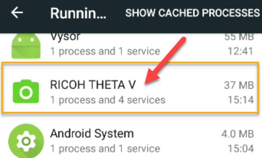

Stop the *CameraService*.

Be bold and stop the service.

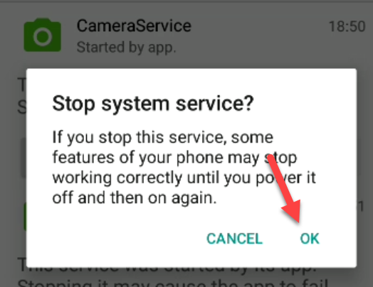

Test the keyboard.

Test the back button.

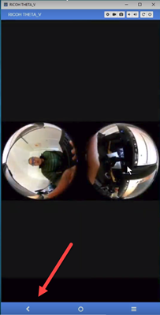

## Using Vysor From Linux or Other OS

I've found the easiest way to Vysor on Linux is to use the 
[Vysor Chrome Extension](https://chrome.google.com/webstore/detail/vysor/gidgenkbbabolejbgbpnhbimgjbffefm?authuser=1) in the Chrome web browser on Linux.

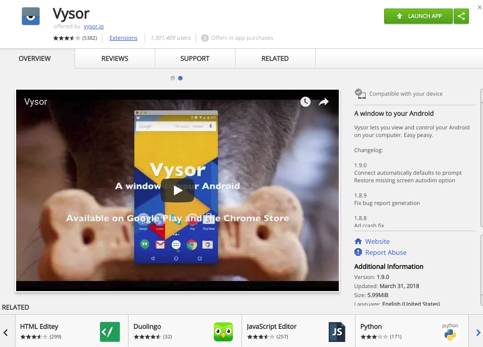

On Linux, you can also install Vysor as a desktop application with the information [here](https://github.com/koush/electron-chrome).

The basic process is shown below.

    git clone https://github.com/koush/electron-chrome.git
    cd electron-chrome
    npm install

Using the Chrome Store app id for Vysor:

    electron --enable-logging . --app-id=gidgenkbbabolejbgbpnhbimgjbffefm

### Fixing Flickering Problem on Certain NVIDIA Cards

On an old NVIDIA graphics card, I needed to disable flipping using the NVIDIA X Server Settings. I am using X11, not Wayland on Ubuntu 18.04.  You can check to see if you're running Wayland or X11 with this:

    $ echo $XDG_SESSION_TYPE
    x11

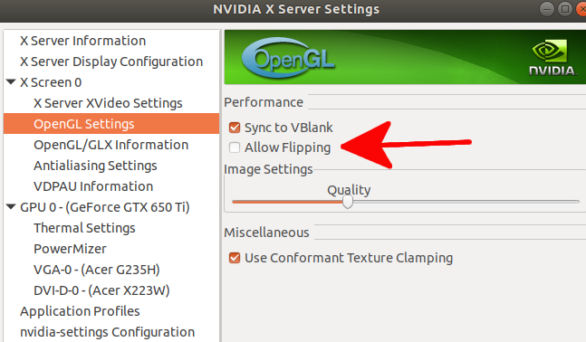