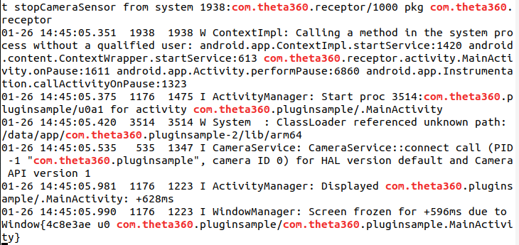
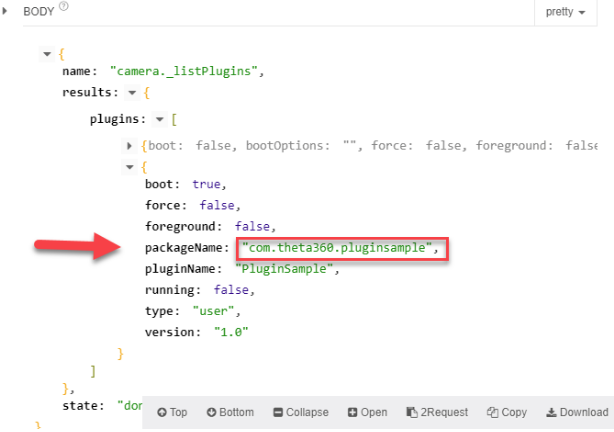
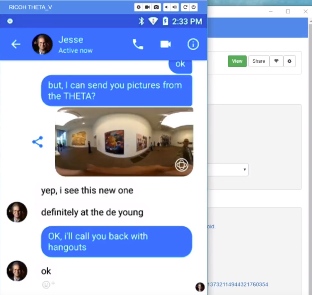
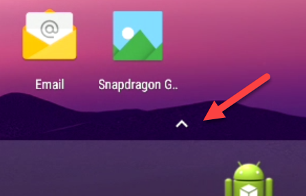
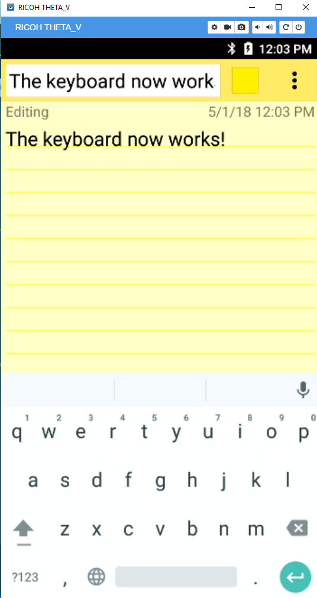
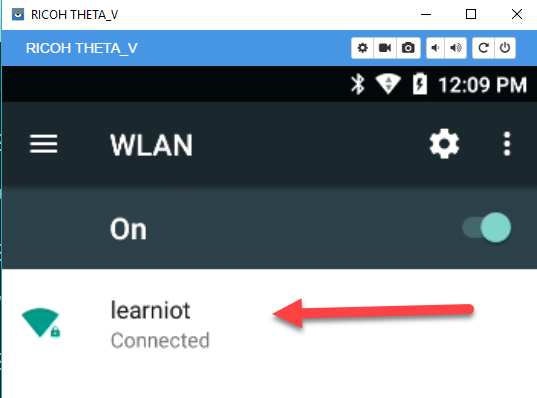

# Development Workflow Tips

## Debugging

You can debug the THETA V with a USB cable and adb.
The camera will operate in Plugin Mode while connected to adb.

You will be able to get debug messages similar to the example below:

       12-14 07:53:24.105  1171  1373 E TaskPersister: File error accessing recents directory (directory doesn't exist?).

Example debug output with the camera connected to my Linux computer with a USB cable 
and in plug-in mode.

## Save HTTP Test Scripts in Separate Tool 

To set the active plugin, you can also use the WiFi API. To use 
the WiFi API, you must connect your 
computer to the THETA with WiFi. 
Although you can use a curl script to switch plugins with the WiFi API,
I find it easier to use a tool like 
Restlet Client to save my HTTP test scripts into a group. I can select an
individual test and run it with a push of a button. To switch plugins, I 
saved a script for  `camera._setPlugin`. You can get a list of plugins with 
`camera._listPlugins`.

In addition to saving the HTTP test scripts, Restlet Client or Postman will show the
JSON response in *pretty* format automatically. With curl, you will need to
pipe the output to another tool to get *pretty print*.

## Using Standard Android Packages
You can download apks from many sites for testing things like 
communication protocol with Facebook Messenger or video transmission.

I've been using this site with good results.

[https://apkpure.com/app](https://apkpure.com/app)

For example, I can send 360 images directly from the THETA V storage to Facebook Messenger.
The images are viewable in 360 by the recipient.

## Using the Keyboard on Vysor

You need to disable the THETA V camera process to use the keyboard.

Connect your THETA V to Vysor.

Expand the apps to find your settings.

Go into settings.

Go to *Developer options*. You may need to [enable developer options](https://developer.android.com/studio/debug/dev-options) by going to *About phone* and 
tapping Build number 7 times.

Access *Running services*.

Select the *RICOH THETA V* process.

Stop the *CameraService*.

Be bold and stop the service.

Test the keyboard.

## Enabling WiFi for All Apps

With the keyboard enabled, you can now type in your password for your WiFi hotspot to connect to the Internet.

Connect to WiFi and all your apps and plug-ins will be able to connect to the Internet.

